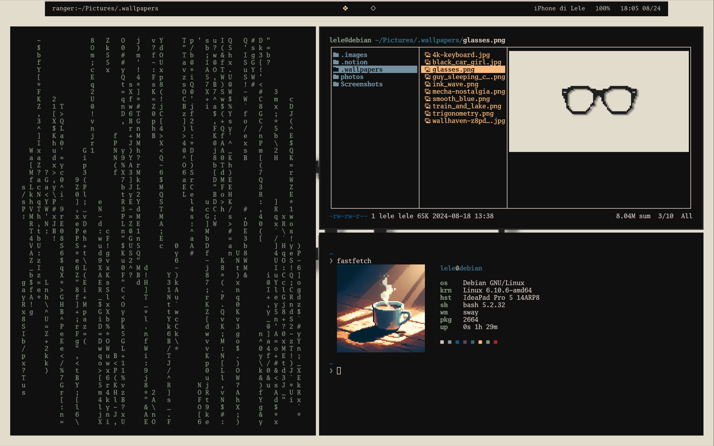

# Dotfiles

## Theme
The color scheme I use is `Vacuous2` with `GoMono Nerd Font`

|  Palette    |  Normal   |  Bright   |  Samples                                                                        |
| ------------| --------- | ----------| --------------------------------------------------------------------------------|
| Background  | `#101010` | `#202020` |         |
| Foreground  | `#d2c5bc` | `#fff0f0` |         |
| Red         | `#b91e2e` | `#d14548` |        |
| Green       | `#81957c` | `#a7b79a` |    |
| Yellow      | `#f9bb80` | `#fae3a0` |  |
| Blue        | `#356579` | `#7491a1` |      |
| Purple      | `#2d2031` | `#87314e` |  |
| Cyan        | `#0b3452` | `#0f829d` |      |

## Stuff
|   **System**                                                         |   **UI**                                                           |   **Programs**                                           |
| ---------------------------------------------------------------------| -------------------------------------------------------------------| ----------| 
| **OS** Debian 12                                                   | **Bar** [waybar](https://github.com/Alexays/Waybar)              | **Editor** [vim](https://github.com/vim/vim)                       |
| **Window Manager** [sway](https://github.com/swaywm/sway)          | **Launcher** [wofi](https://hg.sr.ht/~scoopta/wofi)              | **File manager** [ranger](https://github.com/ranger/ranger)    |
| **Terminal Emulator** [kitty](https://github.com/kovidgoyal/kitty) | **Logout Menu** [wlogout](https://github.com/ArtsyMacaw/wlogout) | **Fetch** [fastfetch](https://github.com/fastfetch-cli/fastfetch) |
| **Shell** bash                                                     | **Screen Locker** [swaylock](https://github.com/swaywm/swaylock) | **System Monitor** [btop](https://github.com/aristocratos/btop)  |
| **PS1** [starship](https://github.com/starship/starship)           | **Notification** [mako](https://github.com/emersion/mako)        | **Decorations** `cmatrix` `tty-clock`                   |

## Screenshots

